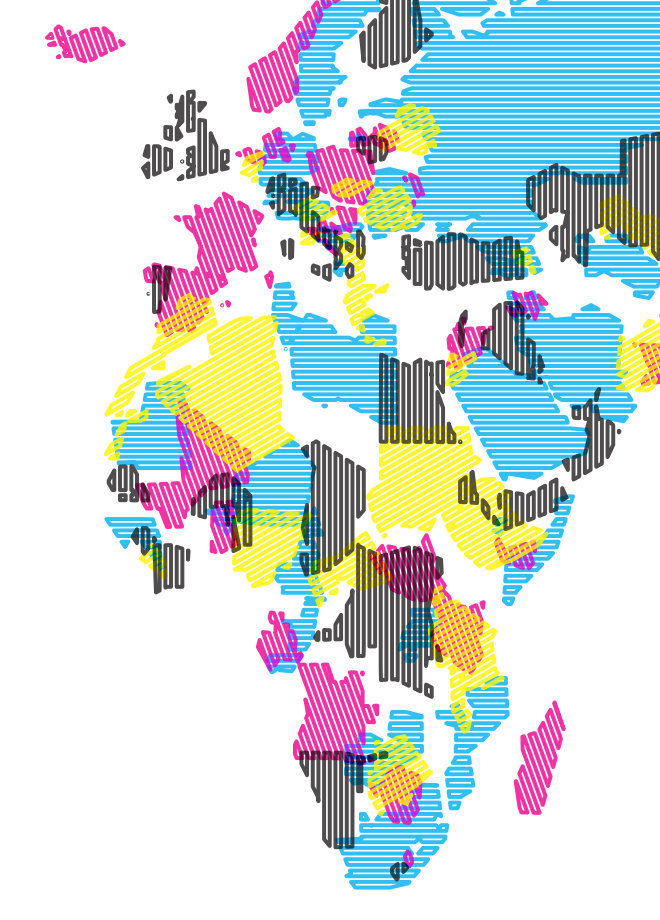
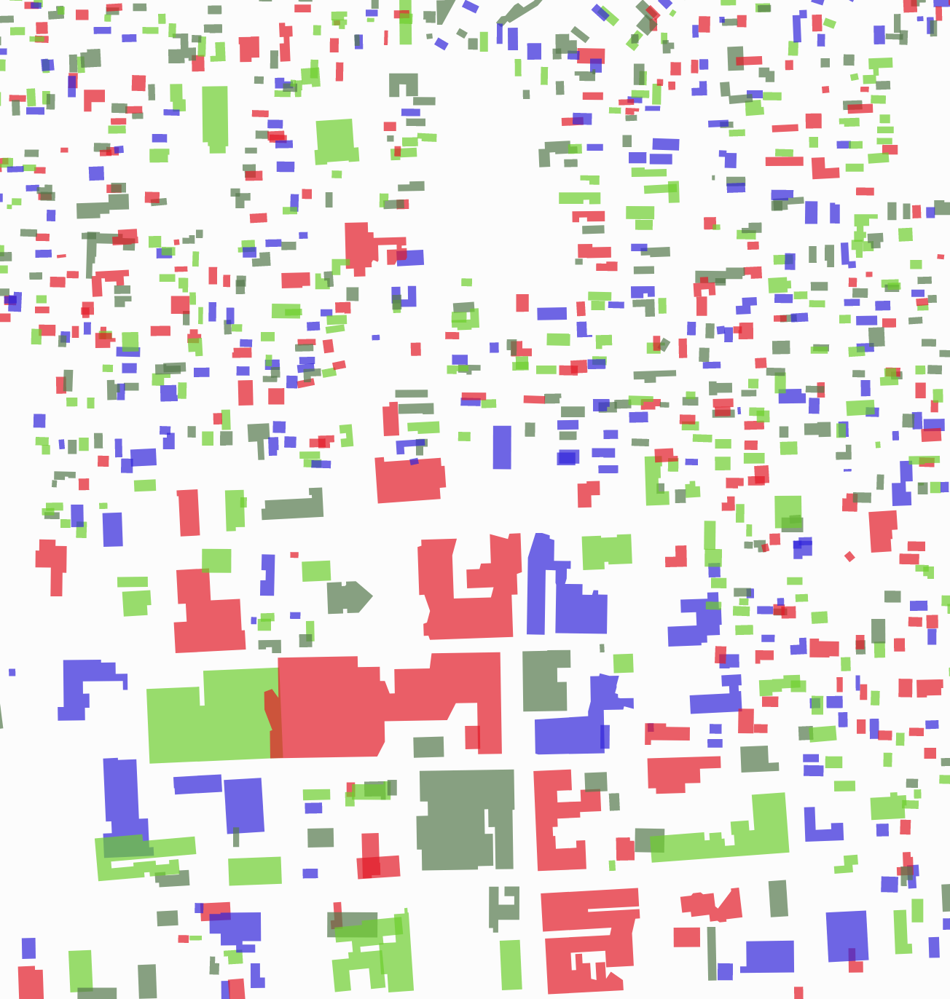
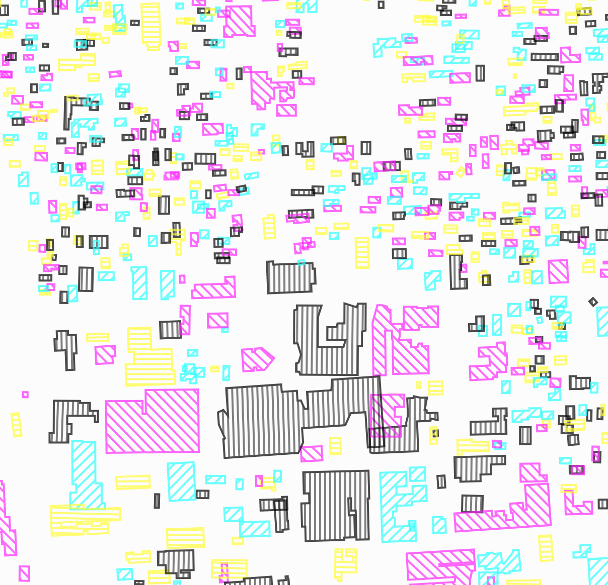

# carte-code
**Wacky maps made with code**

# 1981
Using [Project Linework](http://projectlinework.org) data and [d3.js](https://d3js.org), I randomly shuffle the countries and apply a random color or hatching

# btv
Using Microsoft's [building footprint](https://github.com/Microsoft/USBuildingFootprints) GeoJSON around Burlington VT, I added buttons to randomly rotate the polygons and apply a random color scheme or hatching using [d3.js](https://d3js.org) svg manipulation functions.

_With random colors:_

*With random CMYK hatches:*

## Installation Instructions

Download the repository and open the an index.html file.

(I only have a `package.json` because I use `xo` for Javascript linting)

## Credits
I started by modifying this [example](https://bl.ocks.org/john-guerra/43c7656821069d00dcbc)  
Uses d3 (v3)  
Written on Atom  
With the help of a million Google searches
